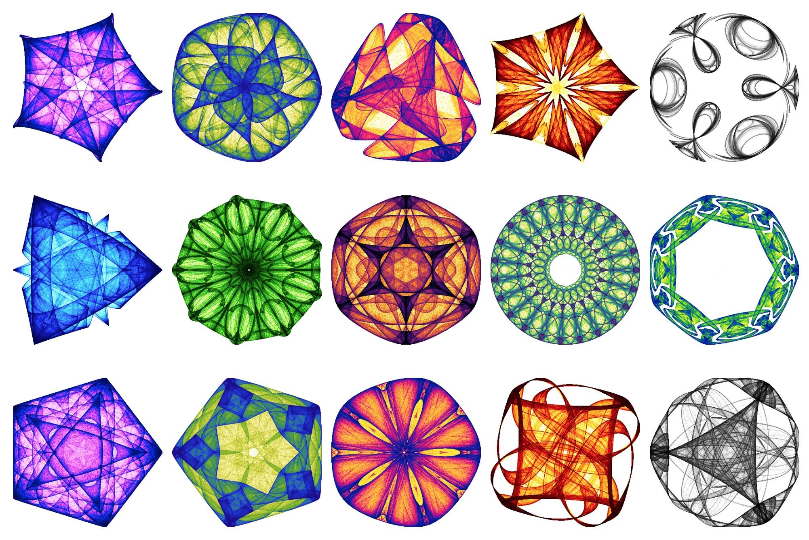
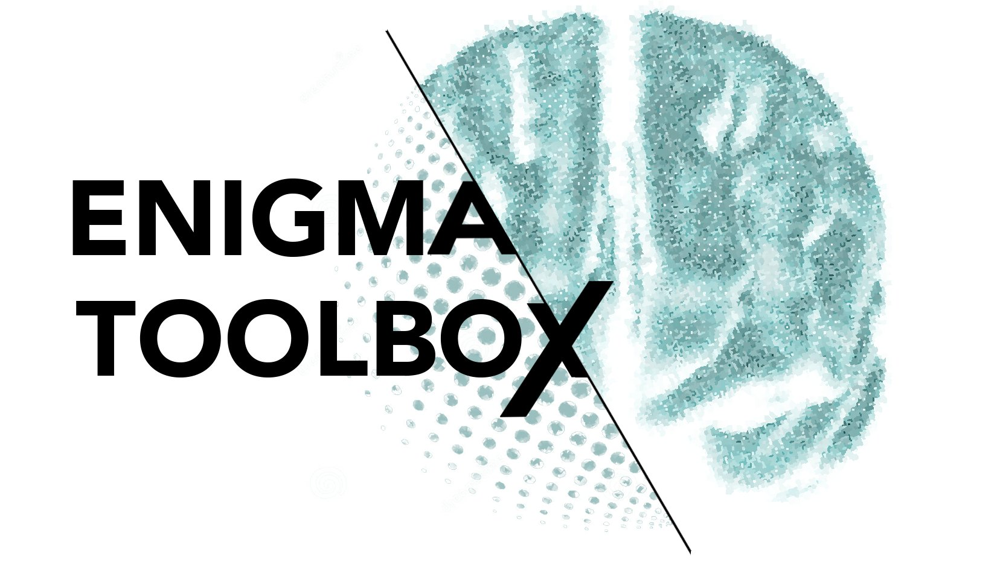
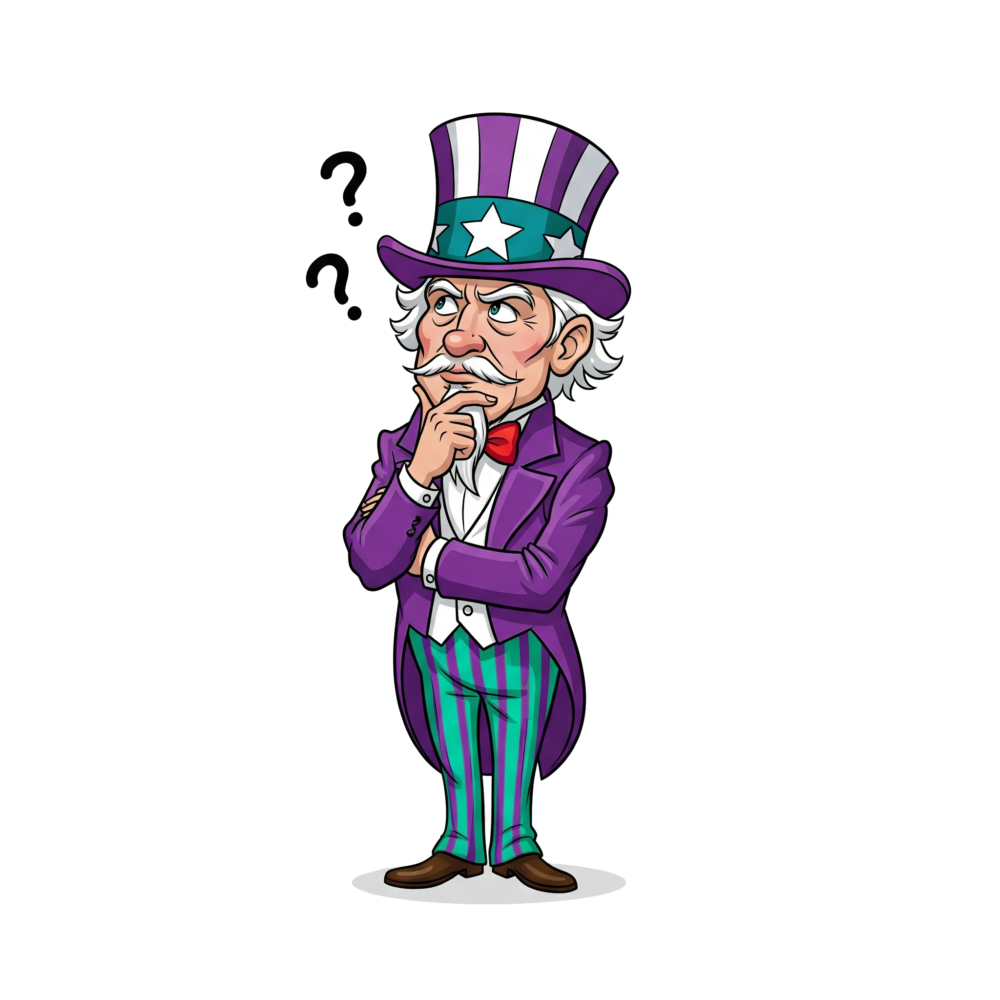

## From Code to Visualization:
# **Reproducible Pipelines for Neuroimaging Research**

Presentation slides for the OHBM Educational Course on

[Maximizing scientific efficiency through sustainability, reproducibility, and FAIRness](https://ww6.aievolution.com/hbm2501/Events/viewEv?ev=2237)

<div class="abs-br m-6 text-xl">
  <a href="https://sina-mansour.github.io/" target="_blank" class="slidev-icon-btn">
    <carbon:user-avatar-filled />
  </a>
  <a href="https://github.com/sina-mansour" target="_blank" class="slidev-icon-btn">
    <carbon:logo-github />
  </a>
</div>

<div class="abs-bl m-6 flex items-center gap-2">
  
  <div>
    <div class="text-4 text-left">Sina Mansour L.</div>
    <div class="text-2 text-left italic">National University of Singapore & The University of Melbourne</div>
    <div class="text-2 text-left italic"><carbon:email /> sina.mansour.lakouraj@gmail.com</div>
  </div>
</div>

<a href="https://sina-mansour.github.io/ohbm2025-reproducible-research/intro.html" target="_blank">
  
</a>

<div class="abs-tl m-6 text-sm">
  <carbon:calendar /> June. 24. 2025
</div>


---
layout: default
transition: slow-fade
---

# Disclosure

Speaker Name: *Sina Mansour L.*

I have the following to disclose:

<ul class="text-4 w-3/4" v-click="1" v-motion:initial="{ x: -20 }":enter="{ x: -20 }">
  <li class="flex gap-2 pb-4" v-click="1">
    <div class="text-cyan-500" v-click="[1,2]" v-motion :initial="{ rotate: -200 }" :enter="{ rotate: 0 }" :leave="{ rotate: 200 }"><carbon:send /></div>
    <div>Code/Data Availability: All data and code supporting this presentation are available online (scan QR code). </div>
  </li>
  <li class="flex gap-2 pb-4" v-click="2">
    <div class="text-cyan-500" v-click="[2,3]" v-motion :initial="{ rotate: -200 }" :enter="{ rotate: 0 }" :leave="{ rotate: 200 }"><carbon:send /></div>
    <div>I hold a positive bias toward Open Science, which I view as promoting better scientific practices. </div>
  </li>
  <li class="flex gap-2 pb-4" v-click="3">
    <div class="text-cyan-500" v-click="[3,4]" v-motion :initial="{ rotate: -200 }" :enter="{ rotate: 0 }" :leave="{ rotate: 200 }"><carbon:send /></div>
    <div>I am one of the core developers of the Cerebro Brain Viewer.</div>
  </li>
  <li class="flex gap-2 pb-4" v-click="4">
    <div class="text-cyan-500" v-click="4" v-motion :initial="{ rotate: -200 }" :enter="{ rotate: 0 }" :leave="{ rotate: 200 }"><carbon:send /></div>
    <div>AI use: I draft all content myself, with AI tools assisting in refining the wording. Final edits are reviewed to ensure they reflect my voice and intent.</div>
  </li>
</ul>

<a href="https://sina-mansour.github.io/ohbm2025-reproducible-research/intro.html" target="_blank" v-click="1">
  
</a>

<myFooter />

---
layout: default
transition: slow-fade
---

# Overview

<ul class="text-5" v-click="1" v-motion:initial="{ x: -20 }":enter="{ x: -20 }">
  <li class="flex gap-2 pb-2" v-click="1">
    <div class="text-cyan-500" v-click="[1,2]" v-motion :initial="{ rotate: -200 }" :enter="{ rotate: 0 }" :leave="{ rotate: 200 }"><carbon:send /></div>
    <div>📗 Why Reproducibility Matters</div>
  </li>
  <li class="flex gap-2 pb-2" v-click="2">
    <div class="text-cyan-500" v-click="[2,3]" v-motion :initial="{ rotate: -200 }" :enter="{ rotate: 0 }" :leave="{ rotate: 200 }"><carbon:send /></div>
    <div>📘 Building Reproducible Analysis Pipelines</div>
  </li>
  <li class="flex gap-2 pb-2" v-click="3">
    <div class="text-cyan-500" v-click="[3,4]" v-motion :initial="{ rotate: -200 }" :enter="{ rotate: 0 }" :leave="{ rotate: 200 }"><carbon:send /></div>
    <div>📘1️⃣ Coding Best Practices</div>
  </li>
  <li class="flex gap-2 pb-2" v-click="4">
    <div class="text-cyan-500" v-click="[4,5]" v-motion :initial="{ rotate: -200 }" :enter="{ rotate: 0 }" :leave="{ rotate: 200 }"><carbon:send /></div>
    <div>📘2️⃣ Using Notebooks Effectively</div>
  </li>
  <li class="flex gap-2 pb-2" v-click="5">
    <div class="text-cyan-500" v-click="[5,6]" v-motion :initial="{ rotate: -200 }" :enter="{ rotate: 0 }" :leave="{ rotate: 200 }"><carbon:send /></div>
    <div>📙 Reproducible Scientific Visualizations</div>
  </li>
  <li class="flex gap-2 pb-2" v-click="6">
    <div class="text-cyan-500" v-click="[6,7]" v-motion :initial="{ rotate: -200 }" :enter="{ rotate: 0 }" :leave="{ rotate: 200 }"><carbon:send /></div>
    <div>📙1️⃣ Programmatic Visualizations</div>
  </li>
  <li class="flex gap-2 pb-2" v-click="7">
    <div class="text-cyan-500" v-click="[7,8]" v-motion :initial="{ rotate: -200 }" :enter="{ rotate: 0 }" :leave="{ rotate: 200 }"><carbon:send /></div>
    <div>📙2️⃣ Visualization Tools</div>
  </li>
  <li class="flex gap-2 pb-2" v-click="8">
    <div class="text-cyan-500" v-click="8" v-motion :initial="{ rotate: -200 }" :enter="{ rotate: 0 }" :leave="{ rotate: 200 }"><carbon:send /></div>
    <div>📙3️⃣ Practical Visualization Examples</div>
  </li>
</ul>

<myFooter />

---
layout: default
transition: slow-fade
---

# 📗 Reproducibility in Neuroimaging

🤨 Why Care about Reproducibility?

<ul class="text-5" v-click="1" v-motion:initial="{ x: -20 }":enter="{ x: -20 }">
  <li class="flex gap-2 pb-2" v-click="1">
    <div class="text-cyan-500" v-click="[1,2]" v-motion :initial="{ rotate: -200 }" :enter="{ rotate: 0 }" :leave="{ rotate: 200 }"><carbon:send /></div>
    <div>Science builds on science, without reproducibility, findings can't be trusted or extended.</div>
  </li>
  <li class="flex gap-2 pb-2" v-click="2">
    <div class="text-cyan-500" v-click="[2,3]" v-motion :initial="{ rotate: -200 }" :enter="{ rotate: 0 }" :leave="{ rotate: 200 }"><carbon:send /></div>
    <div>Neuroimaging findings are often results of complex pipelines, built with multiple software tools, and parameter choices.</div>
  </li>
  <li class="flex gap-2 pb-2" v-click="3">
    <div class="text-cyan-500" v-click="3" v-motion :initial="{ rotate: -200 }" :enter="{ rotate: 0 }" :leave="{ rotate: 200 }"><carbon:send /></div>
    <div>Without access to code, even small analytical tweaks can become a cumbersome burden for future researchers.</div>
  </li>
</ul>

<myFooter />

---
layout: default
transition: slow-fade
---

# 📗 Reproducibility in Neuroimaging

🤔 What's at Stake?

<ul class="text-5" v-click="1" v-motion:initial="{ x: -20 }":enter="{ x: -20 }">
  <li class="flex gap-2 pb-2" v-click="1">
    <div class="text-cyan-500" v-click="[1,2]" v-motion :initial="{ rotate: -200 }" :enter="{ rotate: 0 }" :leave="{ rotate: 200 }"><carbon:send /></div>
    <div><b>Credibility</b></div>
    <div class="italic border-l-4 pl-4 border-gray-400 text-gray-600">
      “The authors of research papers have no obligation to share their data and code, and <span class="text-rose-500">I have no obligation to believe anything they write.</span>” 
      <br />— Andrew Gelman, professor of statistics at Columbia University
    </div>
  </li>
  <li class="flex gap-2 pb-2" v-click="2">
    <div class="text-cyan-500" v-click="[2,3]" v-motion :initial="{ rotate: -200 }" :enter="{ rotate: 0 }" :leave="{ rotate: 200 }"><carbon:send /></div>
    <div><b>Wasted time</b> taken to re-implement procedures reported in previous works.</div>
  </li>
  <li class="flex gap-2 pb-2" v-click="3">
    <div class="text-cyan-500" v-click="3" v-motion :initial="{ rotate: -200 }" :enter="{ rotate: 0 }" :leave="{ rotate: 200 }"><carbon:send /></div>
    <div><b>Reduced impact</b> of research findings, as they cannot be easily verified or built upon.</div>
  </li>
</ul>

<myFooter />

---
layout: default
transition: slow-fade
---

# 📗 Reproducibility in Neuroimaging

🚩 Let's Start

<ul class="text-5" v-click="1" v-motion:initial="{ x: -20 }":enter="{ x: -20 }">
  <li class="flex gap-2 pb-2" v-click="1">
    <div class="text-cyan-500" v-click="[1,2]" v-motion :initial="{ rotate: -200 }" :enter="{ rotate: 0 }" :leave="{ rotate: 200 }"><carbon:send /></div>
    <div>Now that we agree on why reproducibility matters...</div>
  </li>
  <li class="flex gap-2 pb-2" v-click="2">
    <div class="text-cyan-500" v-click="[2,3]" v-motion :initial="{ rotate: -200 }" :enter="{ rotate: 0 }" :leave="{ rotate: 200 }"><carbon:send /></div>
    <div>...in this session, we'll discuss <b>how to improve reproducibility</b> by openly sharing code.</div>
  </li>
  <li class="flex gap-2 pb-2" v-click="3">
    <div class="text-cyan-500" v-click="[3,4]" v-motion :initial="{ rotate: -200 }" :enter="{ rotate: 0 }" :leave="{ rotate: 200 }"><carbon:send /></div>
    <div><b>Two</b> main topics:</div>
  </li>
  <li class="flex gap-2 pb-2" v-click="4">
    <div class="text-cyan-500" v-click="[4,5]" v-motion :initial="{ rotate: -200 }" :enter="{ rotate: 0 }" :leave="{ rotate: 200 }"><carbon:send /></div>
    <div>🧪 Reproducible <b>analysis pipelines</b>.</div>
  </li>
  <li class="flex gap-2 pb-2" v-click="5">
    <div class="text-cyan-500" v-click="5" v-motion :initial="{ rotate: -200 }" :enter="{ rotate: 0 }" :leave="{ rotate: 200 }"><carbon:send /></div>
    <div>🖼️ Reproducible <b>visualizations</b>.</div>
  </li>
</ul>

<myFooter />

---
layout: default
transition: slow-fade
---

# 📘 Building Reproducible Analysis Pipelines

🎯 Chapter Goals

<ul class="text-5" v-click="1" v-motion:initial="{ x: -20 }":enter="{ x: -20 }">
  <li class="flex gap-2 pb-2" v-click="1">
    <div class="text-cyan-500" v-click="[1,2]" v-motion :initial="{ rotate: -200 }" :enter="{ rotate: 0 }" :leave="{ rotate: 200 }"><carbon:send /></div>
    <div>👉 Show reproducible research starts with how we write, document, and share code.</div>
  </li>
  <li class="flex gap-2 pb-2" v-click="2">
    <div class="text-cyan-500" v-click="[2,3]" v-motion :initial="{ rotate: -200 }" :enter="{ rotate: 0 }" :leave="{ rotate: 200 }"><carbon:send /></div>
    <div>🌟 Best practices for <b>building reproducible analysis pipelines</b>.</div>
  </li>
  <li class="flex gap-2 pb-2" v-click="3">
    <div class="text-cyan-500" v-click="3" v-motion :initial="{ rotate: -200 }" :enter="{ rotate: 0 }" :leave="{ rotate: 200 }"><carbon:send /></div>
    <div>🛠️ Introduce tools that facilitate <b>continuous and seamless</b> code sharing.</div>
  </li>
</ul>

<myFooter />

---
layout: default
transition: slow-fade
---

# 📘1️⃣ Coding Best Practices

🐘 in the room!


<ul class="text-4 w-2/5" v-click="[1,5]" v-motion:initial="{ x: -20 }":enter="{ x: -20 }">
  <li class="flex gap-2 pb-2" v-click="2">
    <div class="text-cyan-500" v-click="[2,3]" v-motion :initial="{ rotate: -200 }" :enter="{ rotate: 0 }" :leave="{ rotate: 200 }"><carbon:send /></div>
    <div>Many of us hesitate to share code, often out of fear of being judged.</div>
  </li>
  <li class="flex gap-2 pb-2" v-click="3">
    <div class="text-cyan-500" v-click="[3,4]" v-motion :initial="{ rotate: -200 }" :enter="{ rotate: 0 }" :leave="{ rotate: 200 }"><carbon:send /></div>
    <div>There are <b>simple, effective</b> ways to boost code quality.</div>
  </li>
  <li class="flex gap-2 pb-2" v-click="4">
    <div class="text-cyan-500" v-click="[4,5]" v-motion :initial="{ rotate: -200 }" :enter="{ rotate: 0 }" :leave="{ rotate: 200 }"><carbon:send /></div>
    <div>These require little time, and can save us significant effort down the line.</div>
  </li>
</ul>

<ul class="absolute text-4 w-4/5 top-1/3 left-1/10 w-4/5" v-click="5" v-motion:initial="{ x: -20 }":enter="{ x: -20 }">
  <li class="flex gap-2 pb-2" v-click="5">
    <div class="text-cyan-500" v-click="[5,6]" v-motion :initial="{ rotate: -200 }" :enter="{ rotate: 0 }" :leave="{ rotate: 200 }"><carbon:send /></div>
    <div>Code sharing is no longer a luxury, it’s increasingly expected, made easier by accessible tools and community-driven standards.</div>
  </li>
  <li class="flex gap-2 pb-2" v-click="6">
    <div class="text-cyan-500" v-click="[6,7]" v-motion :initial="{ rotate: -200 }" :enter="{ rotate: 0 }" :leave="{ rotate: 200 }"><carbon:send /></div>
    <div>Open science is gaining momentum, and with it, a welcome shift: <b>code doesn’t need to be flawless to be valuable</b>.</div>
  </li>
  <li class="flex gap-2 pb-2" v-click="7">
    <div class="text-cyan-500" v-click="7" v-motion :initial="{ rotate: -200 }" :enter="{ rotate: 0 }" :leave="{ rotate: 200 }"><carbon:send /></div>
    <div>Any effort to share code is generally appreciated far more than not sharing anything at all.</div>
  </li>
</ul>

<myFooter />

---
layout: default
transition: slow-fade
---

# 📘1️⃣ Coding Best Practices

👣 Small Steps Toward Better Coding Practices!

<ul class="text-5" v-click="1" v-motion:initial="{ x: -20 }":enter="{ x: -20 }">
  <li class="flex gap-2 pb-2" v-click="1">
    <div class="text-cyan-500" v-click="[1,2]" v-motion :initial="{ rotate: -200 }" :enter="{ rotate: 0 }" :leave="{ rotate: 200 }"><carbon:send /></div>
    <div><b>Commenting</b> 💭</div>
  </li>
  <li class="flex gap-2 pb-2" v-click="3">
    <div class="text-cyan-500" v-click="[3,4]" v-motion :initial="{ rotate: -200 }" :enter="{ rotate: 0 }" :leave="{ rotate: 200 }"><carbon:send /></div>
    <div>Comments are essential for making code shareable and understandable.</div>
  </li>
  <li class="flex gap-2 pb-2" v-click="4">
    <div class="text-cyan-500" v-click="[4,5]" v-motion :initial="{ rotate: -200 }" :enter="{ rotate: 0 }" :leave="{ rotate: 200 }"><carbon:send /></div>
    <div><b>Where do I place comments?</b></div>
  </li>
</ul>

<div class="absolute text-4 w-3/5 left-1/5 top-4/8" v-click="[5,6]" v-motion :initial="{ x: -50}" :enter="{ x : 0}" :leave="{ x : 50}">
  <b>Top-level script comments:</b> For each script, include a brief description of its purpose, inputs, and outputs. Include at least one example of how to run the script.
</div>

<div class="absolute text-4 w-3/5 left-1/5 top-4/8" v-click="6" v-motion :initial="{ x: -50}" :enter="{ x : 0}" :leave="{ x : 50}">
  <b>Inline comments:</b> Throughout your code, include comments explaining what key blocks or lines are doing.
</div>

<div class="absolute text-4 w-3/5 left-1/5 top-5/8" v-click="7">
  This isn’t just for others, it’ll help your future self, too! 😅
</div>


<myFooter />

---
layout: default
transition: slow-fade
---

# 📘1️⃣ Coding Best Practices

👣 Small Steps Toward Better Coding Practices!

<ul class="text-5" v-click="1" v-motion:initial="{ x: -20 }":enter="{ x: -20 }">
  <li class="flex gap-2 pb-2" v-click="1">
    <div class="text-cyan-500" v-click="[1,2]" v-motion :initial="{ rotate: -200 }" :enter="{ rotate: 0 }" :leave="{ rotate: 200 }"><carbon:send /></div>
    <div><b>Variables</b> ☢️</div>
  </li>
  <li class="flex gap-2 pb-2" v-click="[2,4]">
    <div class="text-cyan-500" v-click="[2,3]" v-motion :initial="{ rotate: -200 }" :enter="{ rotate: 0 }" :leave="{ rotate: 200 }"><carbon:send /></div>
    <div><b>Avoid hard-coding values.</b> Instead of embedding parameters directly into your code (e.g., file paths, thresholds, or flags), assign them to variables.</div>
  </li>
  <li class="flex gap-2 pb-2" v-click="[3,4]">
    <div class="text-cyan-500" v-click="[3,4]" v-motion :initial="{ rotate: -200 }" :enter="{ rotate: 0 }" :leave="{ rotate: 200 }"><carbon:send /></div>
    <div><b>Centralize configurable parameters.</b> Define variables that others might need to modify, such as input/output paths or settings, at the top of your script.</div>
  </li>
</ul>


<myFooter />

---
layout: default
transition: slow-fade
---

# 📘1️⃣ Coding Best Practices

👣 Small Steps Toward Better Coding Practices!

<ul class="text-5" v-click="1" v-motion:initial="{ x: -20 }":enter="{ x: -20 }">
  <li class="flex gap-2 pb-2" v-click="1">
    <div class="text-cyan-500" v-click="[1,2]" v-motion :initial="{ rotate: -200 }" :enter="{ rotate: 0 }" :leave="{ rotate: 200 }"><carbon:send /></div>
    <div><b>Functions</b> 🪄</div>
  </li>
  <li class="flex gap-2 pb-2" v-click="2">
    <div class="text-cyan-500" v-click="[2,3]" v-motion :initial="{ rotate: -200 }" :enter="{ rotate: 0 }" :leave="{ rotate: 200 }"><carbon:send /></div>
    <div><b>Functions</b> are reusable building blocks. Break your code into logical, modular, reusable functions wherever possible.</div>
  </li>
  <li class="flex gap-2 pb-2" v-click="3">
    <div class="text-cyan-500" v-click="3" v-motion :initial="{ rotate: -200 }" :enter="{ rotate: 0 }" :leave="{ rotate: 200 }"><carbon:send /></div>
    <div><b>A good rule of thumb:</b> If a code block appears more than twice, it's probably worth turning into a function.</div>
  </li>
</ul>

<myFooter />

---
layout: default
transition: slow-fade
---

# 📘1️⃣ Coding Best Practices

👣 Small Steps Toward Better Coding Practices!

<ul class="text-5 w-3/4" v-click="1" v-motion:initial="{ x: -20 }":enter="{ x: -20 }">
  <li class="flex gap-2 pb-2" v-click="1">
    <div class="text-cyan-500" v-click="[1,2]" v-motion :initial="{ rotate: -200 }" :enter="{ rotate: 0 }" :leave="{ rotate: 200 }"><carbon:send /></div>
    <div><b>Eliminate Duplication</b> 🗑️</div>
  </li>
  <li class="flex gap-2 pb-2" v-click="2">
    <div class="text-cyan-500" v-click="[2,3]" v-motion :initial="{ rotate: -200 }" :enter="{ rotate: 0 }" :leave="{ rotate: 200 }"><carbon:send /></div>
    <div><b>Within your own code:</b> Use functions to avoid copy-pasting.</div>
  </li>
  <li class="flex gap-2 pb-2" v-click="3">
    <div class="text-cyan-500" v-click="[3,4]" v-motion :initial="{ rotate: -200 }" :enter="{ rotate: 0 }" :leave="{ rotate: 200 }"><carbon:send /></div>
    <div><b>Beyond your code:</b> Don’t reinvent the wheel! Most languages offer high-quality libraries for common tasks.</div>
  </li>
</ul>


<myFooter />

---
layout: default
transition: slow-fade
---

# 📘1️⃣ Coding Best Practices

👣 Small Steps Toward Better Coding Practices!

<ul class="text-5 w-3/4" v-click="1" v-motion:initial="{ x: -20 }":enter="{ x: -20 }">
  <li class="flex gap-2 pb-2" v-click="1">
    <div class="text-cyan-500" v-click="[1,2]" v-motion :initial="{ rotate: -200 }" :enter="{ rotate: 0 }" :leave="{ rotate: 200 }"><carbon:send /></div>
    <div><b>Naming Matters</b> 💬</div>
  </li>
  <li class="flex gap-2 pb-2" v-click="2">
    <div class="text-cyan-500" v-click="[2,3]" v-motion :initial="{ rotate: -200 }" :enter="{ rotate: 0 }" :leave="{ rotate: 200 }"><carbon:send /></div>
    <div><b>Use meaningful names:</b> Choose descriptive names for variables and functions. The broader their scope or importance, the more informative the name should be.</div>
  </li>
  <li class="flex gap-2 pb-2" v-click="3">
    <div class="text-cyan-500" v-click="3" v-motion :initial="{ rotate: -200 }" :enter="{ rotate: 0 }" :leave="{ rotate: 200 }"><carbon:send /></div>
    <div><b>Tab Completion:</b> Most modern text editors support tab completion, so long, descriptive names don’t slow you down!</div>
  </li>
</ul>


<div class="absolute top-91 left-22 h-29 w-140 overflow-hidden rounded-lg shadow-lg">
  
</div>


<myFooter />

---
layout: default
transition: slow-fade
---

# 📘1️⃣ Coding Best Practices

👣 Small Steps Toward Better Coding Practices!

<ul class="text-5" v-click="1" v-motion:initial="{ x: -20 }":enter="{ x: -20 }">
  <li class="flex gap-2 pb-2" v-click="1">
    <div class="text-cyan-500" v-click="[1,2]" v-motion :initial="{ rotate: -200 }" :enter="{ rotate: 0 }" :leave="{ rotate: 200 }"><carbon:send /></div>
    <div><b>Dependencies</b> 📦</div>
  </li>
  <li class="flex gap-2 pb-2" v-click="2">
    <div class="text-cyan-500" v-click="[2,3]" v-motion :initial="{ rotate: -200 }" :enter="{ rotate: 0 }" :leave="{ rotate: 200 }"><carbon:send /></div>
    <div><b>List script requirements:</b> Include a <code>requirements.txt</code> file (or equivalent) to specify the dependencies needed to run your code.</div>
  </li>
  <li class="flex gap-2 pb-2" v-click="3">
    <div class="text-cyan-500" v-click="3" v-motion :initial="{ rotate: -200 }" :enter="{ rotate: 0 }" :leave="{ rotate: 200 }"><carbon:send /></div>
    <div>Alternatively, create a <b>Getting Started</b> section to your project's <code>README</code> file with clear setup instructions.</div>
  </li>
</ul>

<myFooter />

---
layout: default
transition: slow-fade
---

# 📘1️⃣ Coding Best Practices

👣 Small Steps Toward Better Coding Practices!

<ul class="text-5 w-3/4" v-click="1" v-motion:initial="{ x: -20 }":enter="{ x: -20 }">
  <li class="flex gap-2 pb-2" v-click="1">
    <div class="text-cyan-500" v-click="[1,2]" v-motion :initial="{ rotate: -200 }" :enter="{ rotate: 0 }" :leave="{ rotate: 200 }"><carbon:send /></div>
    <div><b>Avoid Commenting Out Code</b> ⚠️</div>
  </li>
  <li class="flex gap-2 pb-2" v-click="2">
    <div class="text-cyan-500" v-click="[2,3]" v-motion :initial="{ rotate: -200 }" :enter="{ rotate: 0 }" :leave="{ rotate: 200 }"><carbon:send /></div>
    <div><b>Don’t</b> toggle code behavior by commenting and uncommenting blocks.</div>
  </li>
  <li class="flex gap-2 pb-2" v-click="3">
    <div class="text-cyan-500" v-click="3" v-motion :initial="{ rotate: -200 }" :enter="{ rotate: 0 }" :leave="{ rotate: 200 }"><carbon:send /></div>
    <div>Instead, use <code>if/else</code> statements, configuration files, or flags for control flow.</div>
  </li>
</ul>


<myFooter />

---
layout: default
transition: slow-fade
---

# 📘1️⃣ Coding Best Practices

👣 Small Steps Toward Better Coding Practices!

<ul class="text-5" v-click="1" v-motion:initial="{ x: -20 }":enter="{ x: -20 }">
  <li class="flex gap-2 pb-2" v-click="1">
    <div class="text-cyan-500" v-click="[1,2]" v-motion :initial="{ rotate: -200 }" :enter="{ rotate: 0 }" :leave="{ rotate: 200 }"><carbon:send /></div>
    <div><b>Archive Your Code</b> 🗂️</div>
  </li>
  <li class="flex gap-2 pb-2" v-click="2">
    <div class="text-cyan-500" v-click="[2,3]" v-motion :initial="{ rotate: -200 }" :enter="{ rotate: 0 }" :leave="{ rotate: 200 }"><carbon:send /></div>
    <div>To make your code citable and discoverable, consider archiving it on a DOI-issuing repository.</div>
  </li>
  <li class="flex gap-2 pb-2" v-click="3">
    <div class="text-cyan-500" v-click="3" v-motion :initial="{ rotate: -200 }" :enter="{ rotate: 0 }" :leave="{ rotate: 200 }"><carbon:send /></div>
    <div><b>Zenodo</b> integrates seamlessly with GitHub, allowing you to create a citable snapshot of your project.</div>
  </li>
</ul>

<myFooter />

---
layout: default
transition: slow-fade
---

# 📘2️⃣ Using Notebooks Effectively

🚀 Jupyter Notebooks to the Rescue

<ul class="text-5" v-click="1" v-motion:initial="{ x: -20 }":enter="{ x: -20 }">
  <li class="flex gap-2 pb-2" v-click="1">
    <div class="text-cyan-500" v-click="[1,2]" v-motion :initial="{ rotate: -200 }" :enter="{ rotate: 0 }" :leave="{ rotate: 200 }"><carbon:send /></div>
    <div>Not every research project results in a software package release.</div>
  </li>
  <li class="flex gap-2 pb-2" v-click="2">
    <div class="text-cyan-500" v-click="[2,3]" v-motion :initial="{ rotate: -200 }" :enter="{ rotate: 0 }" :leave="{ rotate: 200 }"><carbon:send /></div>
    <div>In these cases preparing a software repository can be an overkill or a barrier to sharing</div>
  </li>
  <li class="flex gap-2 pb-2" v-click="3">
    <div class="text-cyan-500" v-click="3" v-motion :initial="{ rotate: -200 }" :enter="{ rotate: 0 }" :leave="{ rotate: 200 }"><carbon:send /></div>
    <div>In this chapter, we will explore how Jupyter Notebooks provide a better solution for reproducible research.</div>
  </li>
</ul>


<myFooter />

---
layout: default
transition: slow-fade
---

# 📘2️⃣ Using Notebooks Effectively

🚀 Jupyter Notebooks to the Rescue

<ul class="text-5" v-click="1" v-motion:initial="{ x: -20 }":enter="{ x: -20 }">
  <li class="flex gap-2 pb-2" v-click="1">
    <div class="text-cyan-500" v-click="[1,2]" v-motion :initial="{ rotate: -200 }" :enter="{ rotate: 0 }" :leave="{ rotate: 200 }"><carbon:send /></div>
    <div><b>Idea:</b> Gradual code writing in a Jupyter Notebook, synced over GitHub, enables seamless provision of open code once a project is final.</div>
  </li>
  <li class="flex gap-2 pb-2" v-click="2">
    <div class="text-cyan-500" v-click="[2,3]" v-motion :initial="{ rotate: -200 }" :enter="{ rotate: 0 }" :leave="{ rotate: 200 }"><carbon:send /></div>
    <div>Basically, backup every analysis on Git from the get-go. If you take the best practices discussed earlier, you can release the repository openly once the project is finalized.</div>
  </li>
  <li class="flex gap-2 pb-2" v-click="3">
    <div class="text-cyan-500" v-click="[3,4]" v-motion :initial="{ rotate: -200 }" :enter="{ rotate: 0 }" :leave="{ rotate: 200 }"><carbon:send /></div>
    <div><b>Note</b>: Whatever programming language you use, there's a good chance it already has a Jupyter integration.</div>
  </li>
  <li class="flex gap-2 pb-2" v-click="4">
    <div class="text-cyan-500" v-click="4" v-motion :initial="{ rotate: -200 }" :enter="{ rotate: 0 }" :leave="{ rotate: 200 }"><carbon:send /></div>
    <div><b>Advantage</b>: Online rendering on GitHub + Live execution support (via Binder or Colab).</div>
  </li>
</ul>

<myFooter />

---
layout: default
transition: slow-fade
---

# 📘2️⃣ Using Notebooks Effectively

🚀 Jupyter Notebooks to the Rescue

<ul class="text-5" v-motion:initial="{ x: -20 }":enter="{ x: -20 }">
  <li class="flex gap-2 pb-2">
    <div class="text-cyan-500" v-motion :initial="{ rotate: -200 }" :enter="{ rotate: 0 }" :leave="{ rotate: 200 }"><carbon:send /></div>
    <div><b>Recommended directory structure:</b></div>
  </li>
</ul>


```bash
──▶ project_directory/              # To be tracked by git
    ├── notebooks/                  # All Jupyter notebooks (.ipynb files)
    │   ├── step_1/                 # Divide your analysis into different steps
    │   │   └── analysis_1.ipynb
    │   ├── step_2/
    │   │   └── analysis_2.ipynb
    ┆   ┆
    │   └── README.md               # Overview or instructions for notebooks
    ├── data/                       # Raw/processed data files
    ├── scripts/                    # [OPTIONAL] Standalone scripts and utility functions
    ├── docs/                       # [OPTIONAL] Documentation
    ├── environment.yml             # or requirements.txt (for dependencies)
    └── README.md                   # Project overview and instructions
```


<myFooter />

---
layout: default
transition: slow-fade
---

# 📘2️⃣ Using Notebooks Effectively

🚀 Jupyter Notebooks to the Rescue

Points to Consider:

<ul class="text-5" v-click="1" v-motion:initial="{ x: -20 }":enter="{ x: -20 }">
  <li class="flex gap-2 pb-2" v-click="1">
    <div class="text-cyan-500" v-click="[1,2]" v-motion :initial="{ rotate: -200 }" :enter="{ rotate: 0 }" :leave="{ rotate: 200 }"><carbon:send /></div>
    <div><b>Notebook Narrative:</b> Keep your notebooks readable by using markdown cells to explain your analysis steps.</div>
  </li>
  <li class="flex gap-2 pb-2" v-click="2">
    <div class="text-cyan-500" v-click="[2,3]" v-motion :initial="{ rotate: -200 }" :enter="{ rotate: 0 }" :leave="{ rotate: 200 }"><carbon:send /></div>
    <div><b>Avoid Large Outputs:</b> To keep notebooks lightweight and fast to load, avoid embedding very large files or images.</div>
  </li>
  <li class="flex gap-2 pb-2" v-click="3">
    <div class="text-cyan-500" v-click="3" v-motion :initial="{ rotate: -200 }" :enter="{ rotate: 0 }" :leave="{ rotate: 200 }"><carbon:send /></div>
    <div><b>Use Git LFS:</b> If your notebooks or data files are large, consider using <a href="https://docs.github.com/en/repositories/working-with-files/managing-large-files/about-git-large-file-storage">Git Large File Storage</a>.</div>
  </li>
</ul>

<myFooter />

---
layout: default
transition: slow-fade
---

# 📙 Reproducible Scientific Visualizations

🎯 Chapter Goals

<ul class="text-5" v-click="1" v-motion:initial="{ x: -20 }":enter="{ x: -20 }">
  <li class="flex gap-2 pb-2" v-click="1">
    <div class="text-cyan-500" v-click="[1,2]" v-motion :initial="{ rotate: -200 }" :enter="{ rotate: 0 }" :leave="{ rotate: 200 }"><carbon:send /></div>
    <div>🚨 Emphasize the importance of making visualizations reproducible</div>
  </li>
  <li class="flex gap-2 pb-2" v-click="2">
    <div class="text-cyan-500" v-click="[2,3]" v-motion :initial="{ rotate: -200 }" :enter="{ rotate: 0 }" :leave="{ rotate: 200 }"><carbon:send /></div>
    <div>🧰 Cover various resources and tools that support reproducible scientific visualizations.</div>
  </li>
  <li class="flex gap-2 pb-2" v-click="3">
    <div class="text-cyan-500" v-click="3" v-motion :initial="{ rotate: -200 }" :enter="{ rotate: 0 }" :leave="{ rotate: 200 }"><carbon:send /></div>
    <div>🛠️ Provide concrete example code for generating common neuroimaging visualizations.</div>
  </li>
</ul>

<myFooter />

---
layout: default
transition: slow-fade
---

# 📙1️⃣ Programmatic Visualizations

🙏 Acknowledgment

<ul class="text-5" v-click="1" v-motion:initial="{ x: -20 }":enter="{ x: -20 }">
  <li class="flex gap-2 pb-2" v-click="1">
    <div class="text-cyan-500" v-click="1" v-motion :initial="{ rotate: -200 }" :enter="{ rotate: 0 }" :leave="{ rotate: 200 }"><carbon:send /></div>
    <div>This chapter draws inspiration from a <a href="https://youtu.be/RTy5iVHHGO8?si=8W4eSJVzfYHGSG5x&t=90">talk by Dr. Sid Chopra</a>, whose insights closely align with the themes I intended to cover here. Several key ideas are adapted, with his kind permission, from that presentation.</div>
  </li>
</ul>


<myFooter />

---
layout: default
transition: slow-fade
---

# 📙1️⃣ Programmatic Visualizations

👀 Why Visualizations Matter

<ul class="text-5" v-click="1" v-motion:initial="{ x: -20 }":enter="{ x: -20 }">
  <li class="flex gap-2 pb-2" v-click="[1,2]">
    <div class="text-cyan-500" v-click="[1,2]" v-motion :initial="{ rotate: -200 }" :enter="{ rotate: 0 }" :leave="{ rotate: 200 }"><carbon:send /></div>
    <div>In scientific research, figures often outlast the text. They are what readers remember and what journalists spotlight.</div>
  </li>
  <li class="flex gap-2 pb-2" v-click="5">
    <div class="text-cyan-500" v-click="[5,6]" v-motion :initial="{ rotate: -200 }" :enter="{ rotate: 0 }" :leave="{ rotate: 200 }"><carbon:send /></div>
    <div>This figure became <b>the public face of the study</b>, an iconic example of how visualizations can amplify a paper’s reach and cultural footprint. Yet despite its popularity, <ins>the original image remains difficult to reproduce</ins>, as standards for sharing visualizations openly were not commonplace in 2014.</div>
  </li>
  <li class="flex gap-2 pb-2" v-click="6">
    <div class="text-cyan-500" v-click="6" v-motion :initial="{ rotate: -200 }" :enter="{ rotate: 0 }" :leave="{ rotate: 200 }"><carbon:send /></div>
    <div>Fortunately, the field has evolved. Visualization science now emphasizes openness and reproducibility, supported by a growing ecosystem of tools.</div>
  </li>
</ul>

<div  v-click="[2,5]" class="absolute top-35 left-1/6 w-10/15" v-motion :initial="{ x: -50}" :enter="{ x : 0}" :leave="{ x : 50}">
  
  <div class="relative left-150 top--8 text-teal-500"><a href="https://doi.org/10.1098/rsif.2014.0873">Petri et al. (2014)</a></div>
</div>


<myFooter />

---
layout: default
transition: slow-fade
---

# 📙1️⃣ Programmatic Visualizations

🖥️ Code- vs. GUI-Based Visualizations

<ul class="text-5 w-3/4" v-click="1" v-motion:initial="{ x: -20 }":enter="{ x: -20 }">
  <li class="flex gap-2 pb-2" v-click="1">
    <div class="text-cyan-500" v-click="[1,2]" v-motion :initial="{ rotate: -200 }" :enter="{ rotate: 0 }" :leave="{ rotate: 200 }"><carbon:send /></div>
    <div>Two common ways of creating scientific visualizations:</div>
  </li>
  <li class="flex gap-2 pb-2" v-click="2">
    <div class="text-cyan-500" v-click="[2,3]" v-motion :initial="{ rotate: -200 }" :enter="{ rotate: 0 }" :leave="{ rotate: 200 }"><carbon:send /></div>
    <div><b>GUI-based visualizations</b></div>
  </li>
  <li class="flex gap-2 pb-2" v-click="3">
    <div class="text-cyan-500" v-click="3" v-motion :initial="{ rotate: -200 }" :enter="{ rotate: 0 }" :leave="{ rotate: 200 }"><carbon:send /></div>
    <div><b>Code-based visualizations</b></div>
  </li>
</ul>


<myFooter />

---
layout: default
transition: slow-fade
---

# 📙1️⃣ Programmatic Visualizations

✳️ Why Use Programmatic Visualizations?

<ul class="text-5" v-click="1" v-motion:initial="{ x: -20 }":enter="{ x: -20 }">
  <li class="flex gap-2 pb-2" v-click="1">
    <div class="text-cyan-500" v-click="[1,2]" v-motion :initial="{ rotate: -200 }" :enter="{ rotate: 0 }" :leave="{ rotate: 200 }"><carbon:send /></div>
    <div><b>Reproducibility:</b> Code-based visualizations are inherently more reproducible.</div>
  </li>
  <li class="flex gap-2 pb-2" v-click="2">
    <div class="text-cyan-500" v-click="[2,3]" v-motion :initial="{ rotate: -200 }" :enter="{ rotate: 0 }" :leave="{ rotate: 200 }"><carbon:send /></div>
    <div><b>Flexibility:</b> Seamlessly tweak styles, input data, or visualization parameters.</div>
  </li>
  <li class="flex gap-2 pb-2" v-click="3">
    <div class="text-cyan-500" v-click="[3,4]" v-motion :initial="{ rotate: -200 }" :enter="{ rotate: 0 }" :leave="{ rotate: 200 }"><carbon:send /></div>
    <div><b>Scalability:</b> Make many visualizations at once, e.g., for animations or sensitivity analyses.</div>
  </li>
  <li class="flex gap-2 pb-2" v-click="4">
    <div class="text-cyan-500" v-click="[4,5]" v-motion :initial="{ rotate: -200 }" :enter="{ rotate: 0 }" :leave="{ rotate: 200 }"><carbon:send /></div>
    <div><b>Interactivity:</b> Support interactive plots, embedded in notebooks and web applications.</div>
  </li>
  <li class="flex gap-2 pb-2" v-click="5">
    <div class="text-cyan-500" v-click="[5,6]" v-motion :initial="{ rotate: -200 }" :enter="{ rotate: 0 }" :leave="{ rotate: 200 }"><carbon:send /></div>
    <div><b>Automation:</b> Integrate visualizations into your analysis pipelines, no manual exports.</div>
  </li>
  <li class="flex gap-2 pb-2" v-click="6">
    <div class="text-cyan-500" v-click="6" v-motion :initial="{ rotate: -200 }" :enter="{ rotate: 0 }" :leave="{ rotate: 200 }"><carbon:send /></div>
    <div><b>Skill reusability:</b> The steep learning curve is offset by code reusability across projects.</div>
  </li>
</ul>

<myFooter />

---
layout: default
transition: slow-fade
---

# 📙1️⃣ Programmatic Visualizations

👉 What Next?

<ul class="text-5 w-2/4" v-click="1" v-motion:initial="{ x: -20 }":enter="{ x: -20 }">
  <li class="flex gap-2 pb-2" v-click="1">
    <div class="text-cyan-500" v-click="[1,2]" v-motion :initial="{ rotate: -200 }" :enter="{ rotate: 0 }" :leave="{ rotate: 200 }"><carbon:send /></div>
    <div>Introduce tools, libraries, and templates that facilitate code-based visualizations.</div>
  </li>
  <li class="flex gap-2 pb-2" v-click="2">
    <div class="text-cyan-500" v-click="2" v-motion :initial="{ rotate: -200 }" :enter="{ rotate: 0 }" :leave="{ rotate: 200 }"><carbon:send /></div>
    <div>Share example code (Jupyter notebooks) that showcase code-based visualizations.</div>
  </li>
</ul>

<a href="https://sina-mansour.github.io/ohbm2025-reproducible-research/intro.html" target="_blank" v-click="1">
  
</a>

<myFooter />

---
layout: default
transition: slow-fade
---

# 📙2️⃣ Scientific Visualization Tools

👉 What Next?

<ul class="text-5" v-click="1" v-motion:initial="{ x: -20 }":enter="{ x: -20 }">
  <li class="flex gap-2 pb-2" v-click="1">
    <div class="text-cyan-500" v-click="[1,2]" v-motion :initial="{ rotate: -200 }" :enter="{ rotate: 0 }" :leave="{ rotate: 200 }"><carbon:send /></div>
    <div>We will cover a range of Python libraries for scientific visualization.</div>
  </li>
  <li class="flex gap-2 pb-2" v-click="2">
    <div class="text-cyan-500" v-click="2" v-motion :initial="{ rotate: -200 }" :enter="{ rotate: 0 }" :leave="{ rotate: 200 }"><carbon:send /></div>
    <div>We will cover <b>general-purpose</b> and <b>neuroimaging-specific</b> visualization libraries.</div>
  </li>
</ul>

<myFooter />

---
layout: default
transition: slow-fade
---

# 📙2️⃣ Scientific Visualization Tools

📊 General Visualization Tools

<ul class="text-5" v-click="1" v-motion:initial="{ x: -20 }":enter="{ x: -20 }">
  <li class="flex gap-2 pb-2" v-click="1">
    <div class="text-cyan-500" v-click="[1,2]" v-motion :initial="{ rotate: -200 }" :enter="{ rotate: 0 }" :leave="{ rotate: 200 }"><carbon:send /></div>
    <div><b>Basic Plotting Libraries</b></div>
  </li>
</ul>


<a href="https://matplotlib.org/stable/plot_types/index.html" target="_blank">

</a>


<a href="https://seaborn.pydata.org/examples/index.html" target="_blank">

</a>

<myFooter />

---
layout: default
transition: slow-fade
---

# 📙2️⃣ Scientific Visualization Tools

📊 General Visualization Tools

<ul class="text-5 w-1/2" v-click="1" v-motion:initial="{ x: -20 }":enter="{ x: -20 }">
  <li class="flex gap-2 pb-2" v-click="1">
    <div class="text-cyan-500" v-click="[1,2]" v-motion :initial="{ rotate: -200 }" :enter="{ rotate: 0 }" :leave="{ rotate: 200 }"><carbon:send /></div>
    <div>Key Features:</div>
  </li>
  <li class="flex gap-2 pb-2" v-click="2">
    <div class="text-cyan-500" v-click="[2,3]" v-motion :initial="{ rotate: -200 }" :enter="{ rotate: 0 }" :leave="{ rotate: 200 }"><carbon:send /></div>
    <div>Multi-panel layouts</div>
  </li>
  <li class="flex gap-2 pb-2" v-click="3">
    <div class="text-cyan-500" v-click="[3,4]" v-motion :initial="{ rotate: -200 }" :enter="{ rotate: 0 }" :leave="{ rotate: 200 }"><carbon:send /></div>
    <div>Flexible output formats</div>
  </li>
  <li class="flex gap-2 pb-2" v-click="4">
    <div class="text-cyan-500" v-click="[4,5]" v-motion :initial="{ rotate: -200 }" :enter="{ rotate: 0 }" :leave="{ rotate: 200 }"><carbon:send /></div>
    <div>LaTeX support</div>
  </li>
  <li class="flex gap-2 pb-2" v-click="5">
    <div class="text-cyan-500" v-click="5" v-motion :initial="{ rotate: -200 }" :enter="{ rotate: 0 }" :leave="{ rotate: 200 }"><carbon:send /></div>
    <div>NumPy/Pandas integration</div>
  </li>
</ul>


<myFooter />

---
layout: default
transition: slow-fade
---

# 📙2️⃣ Scientific Visualization Tools

📊 General Visualization Tools

<ul class="text-5" v-click="1" v-motion:initial="{ x: -20 }":enter="{ x: -20 }">
  <li class="flex gap-2 pb-2" v-click="1">
    <div class="text-cyan-500" v-click="[1,2]" v-motion :initial="{ rotate: -200 }" :enter="{ rotate: 0 }" :leave="{ rotate: 200 }"><carbon:send /></div>
    <div><b>Interactive Visualizations</b></div>
  </li>
</ul>


<a href="https://plotly.com/python/" target="_blank">

</a>


<myFooter />

---
layout: default
transition: slow-fade
---

# 📙2️⃣ Scientific Visualization Tools

📊 General Visualization Tools

<ul class="text-5 w-1/3" v-click="1" v-motion:initial="{ x: -20 }":enter="{ x: -20 }">
  <li class="flex gap-2 pb-2" v-click="1">
    <div class="text-cyan-500" v-click="[1,2]" v-motion :initial="{ rotate: -200 }" :enter="{ rotate: 0 }" :leave="{ rotate: 200 }"><carbon:send /></div>
    <div><b>Visualizing Large Datasets with Shaders</b></div>
  </li>
</ul>


<a href="https://datashader.org/" target="_blank">

</a>

<myFooter />

---
layout: default
transition: slow-fade
---

# 📙2️⃣ Scientific Visualization Tools

📊 General Visualization Tools

<ul class="text-5" v-click="1" v-motion:initial="{ x: -20 }":enter="{ x: -20 }">
  <li class="flex gap-2 pb-2" v-click="1">
    <div class="text-cyan-500" v-click="[1,2]" v-motion :initial="{ rotate: -200 }" :enter="{ rotate: 0 }" :leave="{ rotate: 200 }"><carbon:send /></div>
    <div><b>Choosing Colormaps</b></div>
  </li>
</ul>


<a href="https://colorcet.com/gallery.html" target="_blank">

</a>

<myFooter />

---
layout: default
transition: slow-fade
---

# 📙2️⃣ Scientific Visualization Tools

🧠 Neuroimaging Visualization Tools

<ul class="text-5" v-click="1" v-motion:initial="{ x: -20 }":enter="{ x: -20 }">
  <li class="flex gap-2 pb-2" v-click="1">
    <div class="text-cyan-500" v-click="[1,2]" v-motion :initial="{ rotate: -200 }" :enter="{ rotate: 0 }" :leave="{ rotate: 200 }"><carbon:send /></div>
    <div>We now turn our attention to neuroimaging-specific visualization tools.</div>
  </li>
  <li class="flex gap-2 pb-2" v-click="2">
    <div class="text-cyan-500" v-click="[2,3]" v-motion :initial="{ rotate: -200 }" :enter="{ rotate: 0 }" :leave="{ rotate: 200 }"><carbon:send /></div>
    <div>We will cover tools to generate a wide range of common neuroimaging figures.</div>
  </li>
  <li class="flex gap-2 pb-2" v-click="3">
    <div class="text-cyan-500" v-click="3" v-motion :initial="{ rotate: -200 }" :enter="{ rotate: 0 }" :leave="{ rotate: 200 }"><carbon:send /></div>
    <div><b>Disclaimer:</b> The list of tools covered is by no means exhaustive, there are links to other resources (including tools for R and Matlab) in the <a href="https://sina-mansour.github.io/ohbm2025-reproducible-research/intro.html" target="_blank">Jupyter Book</a> supplementing this presentation.</div>
  </li>
</ul>

<myFooter />

---
layout: default
transition: slow-fade
---

# 📙2️⃣ Scientific Visualization Tools

🧠 Neuroimaging Visualization Tools

<ul class="text-5" v-click="1" v-motion:initial="{ x: -20 }":enter="{ x: -20 }">
  <li class="flex gap-2 pb-2" v-click="1">
    <div class="text-cyan-500" v-click="[1,2]" v-motion :initial="{ rotate: -200 }" :enter="{ rotate: 0 }" :leave="{ rotate: 200 }"><carbon:send /></div>
    <div>Handling Neuroimaging Data</div>
  </li>
</ul>


<div class="absolute top-75 left-48 text-cyan-600 font-bold" v-click="2" v-motion :initial="{ rotate: -200, scale: 0.1, transition: { duration: 300 } }" :enter="{ rotate: 0, scale: 1, transition: { duration: 300 } }" :leave="{ rotate: 200, scale: 0.1, transition: { duration: 300 } }">NiBabel</div>


<myFooter />

---
layout: default
transition: slow-fade
---

# 📙2️⃣ Scientific Visualization Tools

🧠 Neuroimaging Visualization Tools

<ul class="text-5" v-click="1" v-motion:initial="{ x: -20 }":enter="{ x: -20 }">
  <li class="flex gap-2 pb-2" v-click="1">
    <div class="text-cyan-500" v-click="[1,2]" v-motion :initial="{ rotate: -200 }" :enter="{ rotate: 0 }" :leave="{ rotate: 200 }"><carbon:send /></div>
    <div>Volume Slice Rendering</div>
  </li>
</ul>


<div  v-click="2" class="absolute top-45 left-3/15 w-9/15" v-motion :initial="{ scale: 1, y: 0, x: -50, transition: { duration: 300 }}" :enter="{ scale: 1, y: 0, x : 0}" :click-3="{ scale: 0.5, y: -110, x : 0, transition: { duration: 300 }}" :leave="{ scale: 1, y: 0, x : 50, transition: { duration: 300 }}">
  
  <div class="relative left-150 top--8 text-teal-500"><a href="https://doi.org/10.1038/s41593-025-01945-y">Bolt et al. (2025)</a></div>
</div>


<myFooter />

---
layout: default
transition: slow-fade
---

# 📙2️⃣ Scientific Visualization Tools

🧠 Neuroimaging Visualization Tools

<ul class="text-5" v-click="1" v-motion:initial="{ x: -20 }":enter="{ x: -20 }">
  <li class="flex gap-2 pb-2" v-click="1">
    <div class="text-cyan-500" v-click="[1,2]" v-motion :initial="{ rotate: -200 }" :enter="{ rotate: 0 }" :leave="{ rotate: 200 }"><carbon:send /></div>
    <div>Surface-based Visualizations</div>
  </li>
</ul>


<div  v-click="2" class="absolute top-45 left-5/15 w-14/15" v-motion :initial="{ scale: 1, y: 0, x: -50, transition: { duration: 300 }}" :enter="{ scale: 1, y: 0, x : 0}" :click-3="{ scale: 0.4, y: -140, x : 120, transition: { duration: 300 }}" :leave="{ scale: 1, y: 0, x : 50, transition: { duration: 300 }}">
  
  <div class="relative left-88 top--14 text-teal-500"><a href="https://doi.org/10.1073/pnas.1608282113">Margulies et al. (2016)</a><br><a href="https://doi.org/10.1016/j.tics.2017.11.002">Huntenburg et al. (2018)</a></div>
</div>





<myFooter />

---
layout: default
transition: slow-fade
---

# 📙2️⃣ Scientific Visualization Tools

🧠 Neuroimaging Visualization Tools

<ul class="text-5" v-click="1" v-motion:initial="{ x: -20 }":enter="{ x: -20 }">
  <li class="flex gap-2 pb-2" v-click="1">
    <div class="text-cyan-500" v-click="[1,2]" v-motion :initial="{ rotate: -200 }" :enter="{ rotate: 0 }" :leave="{ rotate: 200 }"><carbon:send /></div>
    <div>Volume-to-Surface Transformation</div>
  </li>
</ul>


<div  v-click="2" class="absolute top-45 left-5/16 w-6/15" v-motion :initial="{ scale: 1, y: 0, x: -50, transition: { duration: 300 }}" :enter="{ scale: 1, y: 0, x : 0}" :click-3="{ scale: 0.4, y: -190, x : 290, transition: { duration: 300 }}" :leave="{ scale: 1, y: 0, x : 50, transition: { duration: 300 }}">
  
  <div class="relative left-100 top--14 text-teal-500"><a href="https://yalebrainatlas.github.io/YaleBrainAtlas/">Yale Brain Atlas</a><br><a href="https://doi.org/10.1038/s41598-022-21543-3">McGrath et al. (2022)</a></div>
</div>


<div class="absolute top-105 left-140 text-cyan-600 font-bold" v-click="[3,4]" v-motion :initial="{ rotate: -200, scale: 0.1, transition: { duration: 300 } }" :enter="{ rotate: 0, scale: 1, transition: { duration: 300 } }" :leave="{ rotate: 200, scale: 0.1, transition: { duration: 300 } }">Surf-Ice</div>

<div  v-click="4" class="absolute top-45 left-6/16 w-4/15" v-motion :initial="{ scale: 0.1, transition: { duration: 300 }}" :enter="{ scale: 1, transition: { duration: 300 }}" :leave="{ scale: 0.1, transition: { duration: 300 }}">
  
  <div class="relative left-67 top--14 text-teal-500"><a href="https://github.com/yetianmed/subcortex">Melbourne Subcortex Atlas</a><br><a href="https://doi.org/10.1038/s41593-020-00711-6">Tian et al. (2020)</a></div>
</div>

<myFooter />

---
layout: default
transition: slow-fade
---

# 📙2️⃣ Scientific Visualization Tools

🧠 Neuroimaging Visualization Tools

<ul class="text-5" v-click="1" v-motion:initial="{ x: -20 }":enter="{ x: -20 }">
  <li class="flex gap-2 pb-2" v-click="1">
    <div class="text-cyan-500" v-click="[1,2]" v-motion :initial="{ rotate: -200 }" :enter="{ rotate: 0 }" :leave="{ rotate: 200 }"><carbon:send /></div>
    <div>Tractography Visualization</div>
  </li>
</ul>


<div  v-click="2" class="absolute top-55 left-3/16 w-10/15" v-motion :initial="{ scale: 1, y: 0, x: -50, transition: { duration: 300 }}" :enter="{ scale: 1, y: 0, x : 0}" :click-3="{ scale: 0.35, y: -210, x : 260, transition: { duration: 300 }}" :leave="{ scale: 1, y: 0, x : 50, transition: { duration: 300 }}">
  
  <div class="relative left-162 top--8 text-teal-500"><a href="https://doi.org/10.1038/ncomms13629">Cox et al. (2016)</a></div>
</div>


<div class="absolute top-105 left-110 text-cyan-600 font-bold" v-click="[3,4]" v-motion :initial="{ rotate: -200, scale: 0.1, transition: { duration: 300 } }" :enter="{ rotate: 0, scale: 1, transition: { duration: 300 } }" :leave="{ rotate: 200, scale: 0.1, transition: { duration: 300 } }">Surf-Ice</div>


<div  v-click="4" class="absolute top-45 left-80 w-5/15" v-motion :initial="{ scale: 0.1, transition: { duration: 300 }}" :enter="{ scale: 1, transition: { duration: 300 }}" :leave="{ scale: 0.1, transition: { duration: 300 }}">
  
  <div class="relative left-85 top--14 text-teal-500"><a href="https://github.com/SlicerDMRI/ORG-Atlases?tab=readme-ov-file">ORG Fiber Clustering Atlas</a><br><a href="https://doi.org/10.1016/j.neuroimage.2018.06.027">Zhang et al. (2018)</a></div>
</div>

<myFooter />

---
layout: default
transition: slow-fade
---

# 📙3️⃣ Practical Visualization Examples

🎮🖥️ Make sure to test the examples on Google Colab!

<a href="https://sina-mansour.github.io/ohbm2025-reproducible-research/intro.html" target="_blank" v-click="1">
  
</a>

<myFooter />

---
layout: default
transition: slow-fade
---

# 📖 Acknowledgements


<div class="absolute top-95 left-45 w-30 text-primary font-bold font-size-3" v-click="[1,2]" v-motion :initial="{ rotate: -200, scale: 0.1, transition: { duration: 300 } }" :enter="{ rotate: 0, scale: 1, transition: { duration: 300 } }" :leave="{ rotate: 200, scale: 0.1, transition: { duration: 300 } }">Computational Brain Imaging Group</div>





<myFooter />
